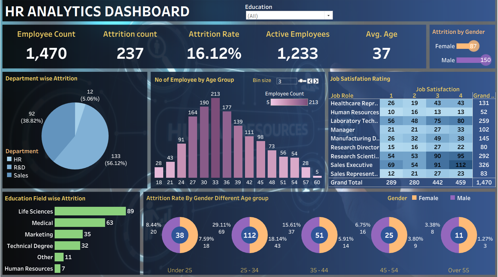

# HR Analytics Dashboard | Tableau

This project presents an interactive HR Analytics Dashboard built using Tableau to analyze employee attrition, workforce demographics, and job satisfaction patterns.

## 📊 Dashboard Overview

The dashboard provides insights into:

- Employee count and active employees
- Attrition count and attrition rate
- Department-wise attrition analysis
- Employee distribution by age group
- Job satisfaction rating by job role
- Attrition by gender and age groups
- Education field-wise attrition

## 🛠 Tools Used

- Tableau (Data Visualization)
- Excel / CSV Dataset (HR data preprocessing)

## 📌 Key KPIs

| Metric | Value |
|-------|------|
| Employee Count | 1470 |
| Attrition Count | 237 |
| Attrition Rate | 16.12% |
| Active Employees | 1233 |
| Average Age | 37 |

## 📈 Insights Derived

- Highest attrition observed in the Sales and R&D departments.
- Employees in the age group 25–34 show higher attrition.
- Job roles like Sales Executive and Research Scientist show varied satisfaction ratings.
- Life Sciences and Medical education fields contribute most to attrition.
- Gender-based attrition trends vary across age groups.

## 🖼 Dashboard Preview

## 📁 Files Included

- `HR_Analytics_Dashboard.twbx` — Tableau packaged workbook
- `HR_Tableau.PNG` — Dashboard screenshot
- `README.md`
## 📂 Dataset

The dataset used for this dashboard is included as `HR_Employee_Data.csv`.  
It contains employee demographics, attrition, job role, education, and satisfaction details used for analysis.

## 🚀 How to Use

1. Download the `.twbx` file.
2. Open using Tableau Desktop.
3. Interact with filters such as Education, Department, Gender, and Age Group.

---

This dashboard helps HR teams and management identify workforce trends and take data-driven decisions to reduce attrition and improve employee satisfaction.
